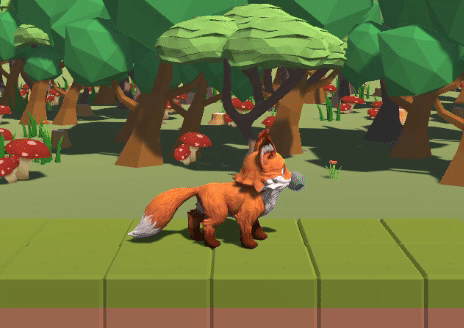

**The University of Melbourne**
# COMP30019 - Graphics and Interaction

For the best visualisation of the game, we would recommend to switch the resolution aspect ratio to Full HD(1920 * 1080). 

## Teamwork Plan/Summary

<!-- [[StartTeamworkPlan]] PLEASE LEAVE THIS LINE UNTOUCHED -->

<!-- Fill this section by Milestone 1 (see specification for details) -->

We have planned out our task progress based on three major components: 
* **General game design** <br/>
All the team members are involved in the discussion of the general game design including the background story, theme and feeling, and the way to play the game. 
* **Aesthetic design** <br/>
Aesthetic design includes visual and audio design, such as model building and music producing, wihch will be mainly assined to Zilun Li and Bruce Zhu, with assistance from Zhikai Wu and Tao Yu. 
* **Game logic script** <br/>
Coding will be done in C# and will be assigned to all members

#### Task Delegation ####
We have kept track of all tasks corresponding to each team member. Below is the summary of our task delegation. Note that we have recorded the task progress by weeks (starting from 17/9 as week 1).
* `Week 1`: 17/9 - 25/9
* `Week 2`: 26/9 - 2/10
* `Week 3`: 3/10 - 9/10
* `Week 4`: 10/10 - 16/10
* `Week 5`: 17/10 - 23/10
* `Week 6`: 24/10 - 31/10

<details>
  <summary><strong>Task Matrix</strong></summary>
  <br/>
  <table>
    <tr>
      <th>Task</th>
      <th>Week</th>
      <th>Assigned to</th>
      <th>Notes</th>
    </tr>
    <tr>
      <td>Game story design</td>
      <td>1</td>
      <td>All</td>
      <td></td>
    </tr>
    <tr>
      <td>Level Draft</td>
      <td>2</td>
      <td>All</td>
      <td></td>
    </tr>
    <tr>
      <td>Create game level structure in unity</td>
      <td>2</td>
      <td>Bruce</td>
      <td>Write logic for LevelManager and GameOperator</td>
    </tr>
    <tr>
      <td>Create background in all levels</td>
      <td>2-3</td>
      <td>Bruce</td>
      <td>Build terrain</td>
    </tr>
    <tr>
      <td>Look for game object models</td>
      <td>2-3</td>
      <td>Zilun</td>
      <td>Find free assets that suit our game style in the unity asset store</td>
    </tr>
    <tr>
      <td>Achieve scenes redirection</td>
      <td>2-3</td>
      <td>Tao Yu</td>
      <td></td>
    </tr>
    <tr>
      <td>Construct the road in all levels</td>
      <td>2-3</td>
      <td>Zilun</td>
      <td>While the game is playable and reasonable, build distinctive levels according to the theme of each level</td>
    </tr>
    <tr>
      <td>Make a basic start scene</td>
      <td>2-3</td>
      <td>Tao Yu</td>
      <td></td>
    </tr>
    <tr>
      <td>Write the movement logic of the player</td>
      <td>3</td>
      <td>Zhikai</td>
      <td>Used 2D player move before but failed to control jumping.</td>
    </tr>
    <tr>
      <td>Add monsters and their movement logic</td>
      <td>3</td>
      <td>Zhikai</td>
      <td></td>
    </tr>
    <tr>
      <td>Write killing player logic</td>
      <td>3</td>
      <td>Bruce</td>
      <td>Killing logic for all objects that can kill the player</td>
    </tr>
    <tr>
      <td>Look for menu bgm and scene bgm</td>
      <td>3</td>
      <td>Bruce</td>
      <td></td>
    </tr>
    <tr>
      <td>Look for audio effect for objects</td>
      <td>3-4</td>
      <td>Bruce</td>
      <td></td>
    </tr>
    <tr>
      <td>Integrate menus </td>
      <td>3-4</td>
      <td>Bruce</td>
      <td>Integrate menu logic and buttons logic into scenes</td>
    </tr>
    <tr>
      <td>Design the animator of the fox</td>
      <td>4</td>
      <td>Tao Yu</td>
      <td>Make the fox model looks natural when the fox moves</td>
    </tr>
    <tr>
      <td>Add death effect of monsters</td>
      <td>4</td>
      <td>Tao Yu</td>
      <td>Add death effect for monsters to make death more viewable</td>
    </tr>
    <tr>
      <td>Add projectile for both player and cannon with logic</td>
      <td>4</td>
      <td>Zhikai</td>
      <td></td>
    </tr>
    <tr>
      <td>Get the elements of each level</td>
      <td>4</td>
      <td>Zilun</td>
      <td>Write script for the movements of element star before and after get it</td>
    </tr>
    <tr>
      <td>Get the Heart of The Forest</td>
      <td>4</td>
      <td>Zilun</td>
      <td>Write script for change color after get element stars</td>
    </tr>
    <tr>
      <td>Edit instruction pages</td>
      <td>4-5</td>
      <td>Zilun</td>
      <td></td>
    </tr>
    <tr>
      <td>Heart of The Forest shader</td>
      <td>5</td>
      <td>Zilun</td>
      <td></td>
    </tr>
    <tr>
      <td>Show stone sprite when cd is 0</td>
      <td>5</td>
      <td>Zilun</td>
      <td></td>
    </tr>
    <tr>
      <td>Projectile particle system</td>
      <td>5</td>
      <td>Zhikai</td>
      <td></td>
    </tr>
    <tr>
      <td>Complete post-work talk through and questionnaire</td>
      <td>5</td>
      <td>All</td>
      <td></td>
    </tr>
    <tr>
      <td>Draft report</td>
      <td>6</td>
      <td>Bruce</td>
      <td></td>
    </tr>
    <tr>
      <td>Outline shader</td>
      <td>6</td>
      <td>Zhikai</td>
      <td>Search for many method and solved with 2 pass which the first one use cull front</td>
    </tr>
    <tr>
      <td>Procedurally generate terrain</td>
      <td>6</td>
      <td>Zhikai</td>
      <td>Do a lot of research on how to generate mesh and items and combine those ideas to make it as simple as we need.</td>
    </tr>
    <tr>
      <td>Lock levels that players can not play yet</td>
      <td>6</td>
      <td>Tao Yu</td>
      <td>Players can not play next level before they complete the level before</td>
    </tr>
    <tr>
      <td>Update according to the feedback of surveys</td>
      <td>6</td>
      <td>All</td>
      <td></td>
    </tr>
  </table>

</details>

<!-- [[EndTeamworkPlan]] PLEASE LEAVE THIS LINE UNTOUCHED -->

## Final Report

#### Table of contents
  - [Technologies](#1-technologies)
  - [Game Summary](#2-game-summary)
  - [How To Play The Game](#3-how-to-play-the-game)
  - [High-level Gameplay Decisions](#4-high-level-gameplay-decisions)
  - [Game Objects Design Decisions](#5-game-objects-design-decisions)
  - [Graphics Pipeline](#6-graphics-pipeline)
  - [Procedural Generation](#7-procedural-generation)
  - [Particle System](#8-particle-system)
  - [Querying And Observational Method](#9-querying-and-observational-method)
  - [Changes Made Based On Evaluation](#10-changes-made-based-on-evaluation)
  - [References](#11-references)


### 1. Technologies
Project is created with:
* Unity 2022.1.9f1 
* Ipsum version: 2.33
* Ament library version: 999

### 2. Game Summary

The game **_Save: The Forest_** is a 2.5D Adventure game made in Unity. The story of the game starts with a forest that has been polluted due to the ongoing industrialisation and the _"Heart of The Forest"_ thereby has lost its vitality to support the thousands of lives residing in the forest. The player would need to control the warrior, Fox, to take on a journey of reviving the forest by crossing through obstacles, defeating enemies and finally collecting the elements including Wood, Water and Soil at the end of each level. 

### 3. How To Play The Game

The player can press keys `"A"` and `"D"` to move the character horizontally, `"SPACE"` to jump and `click` on the mouse to aim and shoot a stone. There exist enemies that cannot be killed, in which case the character needs to jump over them.

The player aims to collect all the stars at the end of each level to win the game. If the character is killed by obstacles or enemies, the current level will restart automatically. In each level, the pause menu can be triggered by pressing the key `"Esc"`, which provides options to go back to the main menu and quit the game. Finally, The player can only reach the next level by completing the current level, and the forest will only be saved after the fox has collected all the elements.

### 4. High-level Gameplay Decisions

<table>
  <tr>
    <th>Question</th>
    <th>Decision</th>
    <th>Reason</th>
  </tr>
  <tr>
    <td>How do we want the user to view and control the character?</td>
    <td>3rd person view and  move the character horizontally</td>
    <td>Inspired by the game videos presented in the lecture and the games we have played in the past, we wanted to create a vibe where the user would be able to observe the environment and control the character easily, making them visually comfortable by locking the direction of the view to reduce the stress of the need to look at different angles.  </td>
  </tr>
  <tr>
    <td>What's the genre of our game? </td>
    <td>Adventure</td>
    <td>By considering the preference of each of the team members, we decided to make an Adventure game as it's a popular genre and we would feel satisfied and comfortable to play such a game. </td>
  </tr>
  <tr>
    <td>Should we have a background story?</td>
    <td>Yes</td>
    <td>We wanted to have a storyline as we believed it would make the game alive, so people wouldn't just enjoy the process of "playing" but also the ethics that the game is trying to pass on.   </td>
  </tr>
  <tr>
    <td>What should be the storyline and ethics of the game?</td>
    <td>An animal tries to save the forest. From here, we are emphasizing the importance of protecting our environment. </td>
    <td>
      We wanted to embed a positive and interesting story into our game and that's how we came out with the current background story. While supporting the idea of environmental protection, we gave a goal to the character in our adventure game as to why the character is going on an adventure and what they try to achieve. <br/><br/>
      We decided to use 3 elements to represent 3 key factors relevant to the forest: Wood, Water and Soil, which we can also use to create different levels in the game.<br/><br/>
      What's even better is that this story makes the game extendable in a way that there may potentially exist more themes (which can be made) in the future, such as save the ocean and save the space.
      </td>
  </tr>
  <tr>
    <td>What's the mood of the game?</td>
    <td>Casual and relaxing</td>
    <td>
    We wanted to create a casual vibe where people would feel relaxed and comfortable while playing the game. 
    </td>
  </tr>
  <tr>
    <td>What should be the difficult level of the game? 
    </td>
    <td>Gradually getting harder in each level, but overall not too difficult to win
    </td>
    <td>We tried not to make the game too long so the user would be able to finish the game in a reasonable time being. Meanwhile, it should have the difficulty to a certain level that the user wouldn't feel bored because they can pass all levels too easily. 
    </td>
  </tr>
</table>

### 5. Game Objects Design Decisions

* **Fox** <br/>
  At the very first beginning, we chose to use a squirrel as the protagonist of our game. However, after searching for material models, we never found any model that met our expectations. We finally chose the current fox model, which fits our theme of cartoon and forest at the same time. The original model provides a list of animations that the fox has. To make the fox moves naturally, we reconstruct the animator. The entry point of the fox is in idle, when players control the fox to move, the fox will turn to running state. In any state, if players press SPACE button, the fox will turn to jump state and go back to running state. Attack is pretty much the same. When all the actions are finished, the fox will return to idle state and wait for next action. 
  <p align="center">
  
  </p>
  
* **Enemies** <br/>
  We used models that suit the style of the game and could potentially hurt the fox to be the enemies, such as thorns, angry logs, poisoned rain and barbettes. As soon as the fox's body touches any of these enemies, the fox will be killed and the level will restart. To increase the playability of the game, the fox has counter-attack abilities. The enemies with red outlines can be killed by the stone that the fox throws. 

  With different types of enemies, the logic for them to kill the fox could be different when it comes to implementation. Take the angry log and the poisoned rain as an example, we simply checked whether the angry log collider interacts with the fox collider to determine when the fox can be killed, whereas we needed to use the ray cast for the poisoned rain to check which object it hits is the fox (there may be blcokers in between). To achieve this, we used inheritance on the killing script and specified the detailed killing logic on different types of enemies. 

  ```C#
  // Parent class
  public class KillPlayer : MonoBehaviour
  {
      [SerializeField] AudioSource myAudioSource;
      private bool killed = false;

      // General killing logic
      protected virtual void OnKilling(NewPlayerControl player)
      {
          player.Kill();
          if (myAudioSource != null && myAudioSource.clip != null)
          {
              myAudioSource.Play();
          }
      }

      private void OnTriggerEnter2D(Collider2D collision) {...}
      private void OnCollisionEnter2D(Collision2D collision) {...}
  }
  ```
  ```C#
  // Child class
  public class PoisonedRain : KillPlayer
  {
      [SerializeField] private LayerMask MushroomLayer;
      private bool killed = false;

      // Killing logic specifically for potioned rain
      protected override void OnKilling(NewPlayerControl player)
      {
          Vector2 start = new Vector2(transform.position.x, transform.position.y);
          Vector2 target = new Vector2(player.transform.position.x, player.transform.position.y);
          
          // Cast a ray from the rain to the player
          if (!Physics2D.Linecast(start, target, MushroomLayer))
          {
              // If there is no mushroom blocker in between, it must hit the player
              // Use the killing logic from the parent here to finish killing
              base.OnKilling(player);
              if (!killed)
              {
                  player.PlayKillSound();
                  killed = true;
              }
          }
      }
      private void OnTriggerStay2D(Collider2D collision)
      {
          if(collision.gameObject.TryGetComponent(out NewPlayerControl player))
          {
              OnKilling(player);              
          }
      }
  }
  ```
  
* **Goals** <br/>
  According to our background story, the fox needs to collect elements to get the "Heart of The Forest". We choose stars as the elements to be collected, and the colors correspond to the theme of each level, wood-yellow, water-blue, earth-orange. For the "Heart of The Forest", we used the model of the heart to add colorful colors to represent the various forest elements. 
  
* **Terrain** <br/>
  We used terrain as our game background. One of the reasons is that it feels "more real" to have a background with the modeling similar to the other objects in the game, making the user feel that the background environment is part of the game rather than just a background. Also, all the game objects including terrain are low-poly objects, for the purpose of keeping the design consistent. 

### 6. Graphics Pipeline
* **Outline Shader (Assets/Shader/Outline Shader)** <br/>
  This shader creates an outline for those shootable objects to clearly indicate which objects can interact with the player's bullet. In the shader, there are two passes, the first pass is used to render the backside of the object and calculate the outline with the normal direction. And the second pass is used to render the original main texture. Here we used _**Cull Front**_ to ensure the second pass would override the first pass as the depth of the second pass will be less than the first one. 
  
* **Forest Heart Shader (Assets/Shader/ForestHeart)** <br/>
  This shader renders the _"Heart of The Forest"_ with multicolored colors to make it more special. A model contains a set of triangular patches, each triangular patch consists of 3 vertices and each vertex contains some vert corresponding data, which is passed into the vertex shader. When the Draw Call is called every frame, the Mesh Render component will send the model data to the Unity Shader. Then pass the structure of the vertex output into the fragment shader, and output the color.
  


### 7. Procedural Generation
We choose to procedurally generate the terrain in the background. And it can be divided into two parts, the `mesh generation` and the `object generation`.

* **Mesh generation** <br/>
  We use the workshop method to generate a plane and use a function **`PerlinNoise`** to generate background mountains and random shape of the plane. In our script, we choose to let the first 1/2 of the mesh be a plane which is easier to put some trees there. And behind this area, we make the coefficient of the PerlinNoise smaller to show more smooth hills and scale it up to be in the sight of the camera.
  
* **Object generation** <br/>
  We tried to use a raycast to generate properly but didn't succeed due to some bug in collision detection. So, we make a simple generator which gives a range of areas and a list of prefabs. It will randomly generate items in this area. We can assign the number of prefabs, the scale, and rotation to generate more randomly.


### 8. Particle system

* **Projectile Spark (Assets/Prefabs/ProjectileSparks.prefab)** <br/>
  >This is the particle system that we would like to be marked on  
  
  From our workshops, we have a concept of the projectile spark effect as a particle system. So we decided to use that idea in our project. As our character will throw a stone as the projectile, we tried to make it look like a split rock at first. But by  accident, we make it more like a boom effect which is quite interesting and can be reused as there are cannon bullets in our game. And the tension of that explosion is quite fascinating. So we keep that effect as the stone's explosion effect. Mainly, we change the color into 3 phrases, red, yellow and black which shows a traditional cannon explosion. We make the particle's lifetime short by 0.00001 to 0.3 second and duration is 0.05s. Also we added 2D gravity to the particles and made the particle size small, between 0.2 and 0.4.During the lifetime, it will also get smaller from 0.5 to 0.1. The shape we make it as a sphere and have a Burst Spread Arc Mode.  
  <p align="center">
    
  </p>


* **Monster Death Smoke** <br/>
  To improve the viewability of the death of monsters, we decided to add a particle system called Death Effect. It's in our prefabs folder. We changed the lifetime and the speed of the particle system to make it look like it happens in a flash. We also changed the shape and the material of the death effect to make it look more like smoke. Therefore, when monsters are killed, the death effect will be generated then they will vanish and become a wisp of smoke.  
    <p align="center">
    
  </p>
  
  


### 9. Querying and Observational Method

We have used observational methods and querying techniques to evaluate the alpha version of our game. Details of such are below. Note that the participants in these two evaluation methods are different. 

* **Observational methods** <br/>
1. Think loud
2. Cooperative evaluation
3. Post-task walkthrough 

<table>
  <tr>
    <th>PID</th>
    <th>Date</th>
    <th>Participant background (occupation? sex? playing games often?)</th>
    <th>Game version</th>
    <th>Method</th>
    <th>Way of capturing</th>
    <th>Details and conclusion</th>
  </tr>
  <tr>
    <td>P01</td>
    <td>21 Oct</td>
    <td>
    Student,
    Female,    
    Not often
    </td>
    <td>1</td>
    <td>2</td>
    <td>Paper</td>
    <td>
      Q: Is the instruction clear?<br/>
      A: Yes<br/>
      Q: Do you find it difficult to win?<br/>
      A: A little <br/>
      Q: Does the game aesthetics fit?<br/>
      A: Yes<br/>
      Q: Does the BGM fit?<br/>
      A: Yes<br/>
      Q: What do you think about the menu UI?<br/>
      A: Simple and clean <br/>
      <strong>Comment:</strong> Died over 30 times in the first and second level
      Issue found: the bullet from the cannon tower would disappear if it is hit by the stone
    </td>
  </tr>
  <tr>
    <td>P02</td>
    <td>21 Oct</td>
    <td>
    Student,
    Male,
    Not often
    </td>
    <td>1</td>
    <td>2</td>
    <td>Paper</td>
    <td>
    Q: Is the instruction clear?<br/>
    A: Yes, easy to play<br/>
    Q: How do you think about the difficulty? <br/>
    A: Normal <br/>
    Q: Does the game aesthetics fit?<br/>
    A: Yes<br/>
    Q: Does the BGM fit?<br/>
    A: Yes<br/>
    Q: What do you think about the menu UI?<br/>
    A: Clean and looks good<br/>
    </td>
  </tr>
  <tr>
    <td>P03</td>
    <td>21 Oct</td>
    <td>
    Student,
    Male,
    Often
    </td>
    <td>1</td>
    <td>2</td>
    <td>Paper</td>
    <td>
    1. Instruction is clear, easy to get started<br/>
    2. Difficulty level is normal, getting harder and more challenging in higher levels<br/>
    3. Aesthetic design and music fit into the game; the design is cute, attractive and also reflects the theme of the game<br/>
    4. BGM is cute, I was attracted by the music as soon a I started<br/>
    5. UI design is simple and clean, I like it<br/>
    6. Menu design is a bit too simple, could have more options<br/>
    7. It would be more interesting to have more levels to play<br/>
    </td>
  </tr>
  <tr>
    <td>P04</td>
    <td>26 Oct</td>
    <td>
    Student,
    Male,
    Often
    </td>
    <td>1</td>
    <td>3</td>
    <td>Computer logging</td>
    <td>
    1. Instruction is clear <br/>
    2. A little difficult, I was stuck at the 3rd level for quite a bit <br/>
    3. Aesthetic design look good <br/>
    4. BGM sounds good <br/>
    5. UI is clean <br/>
    6. There could be more options on the menu, such as fox attacking time interval <br/>
    7. It'd have more fun if there are more enemies 
    </td>
  </tr>
  <tr>
    <td>P05</td>
    <td>23 Oct </td>
    <td>
    Student,
    Male,
    Not often
    </td>
    <td>1</td>
    <td>3</td>
    <td>Paper</td>
    <td>
    1. It's unclear that if the monster can be killed or not <br/>
    2.The game is simple <br/>
    3.The game style is cute <br/>
    4.The game is too short, I finished it very fast <br/>
    </td>
  </tr>
  <tr>
    <td>P06</td>
    <td>25 Oct</td>
    <td>
    Student,
    Male,
    Often
    </td>
    <td>1</td>
    <td>2</td>
    <td>Computer logging</td>
    <td>
    1. Some interaction logic feels a little strange <br/>
    2.I understood half of the story without looking at the instruction <br/>
    3.I like the BGM and the object models <br/>
    4.There are some bugs: stuck at the edge of the object; the fox didn't die even in the water
    </td>
  </tr>
  <tr>
    <td>P07</td>
    <td>24 Oct</td>
    <td>
    Student,
    Male,
    Often
    </td>
    <td>1</td>
    <td>2</td>
    <td>Computer logging</td>
    <td>
    1. Crossing over the cactus at the 3rd  level is very challenging <br/>
    2. BGM is interesting  <br/>
    3. Aesthetic design looks good <br/>
    </td>
  </tr>
</table>

* **Querying techniques** <br/>
1. Interview
2. Questionnaire  

  To see all the questions in the questionnaire, please refer to [Questionnaire](https://docs.google.com/forms/d/1MCrZcmri5Kp8clvIc1qkgGILd2AZdqg6Rm-idn5OyY0/edit "link").  

 <table>
<tr>
  <th>PID</th>
  <th>Date</th>
  <th>Participant background (occupation? sex? playing games often?)</th>
  <th>Game version</th>
  <th>Technique</th>
  <th>Details and conclusion</th>
</tr>
<tr>
    <td>P01</td>
    <td>21 Oct</td>
    <td>
    Student, 
    Male, 
    Not often
    </td>
    <td>1</td>
    <td>2</td>
    <td>Add optional challenges to each level</td>
</tr>
<tr>
    <td>P02</td>
    <td>21 Oct</td>
    <td>
    Student, 
    Female, 
    Not often
    </td>
    <td>1</td>
    <td>2</td>
    <td>The game is fun and the design is great, but the first and third levels are a bit difficult.</td>
</tr>
<tr>
    <td>P03</td>
    <td>23 Oct</td>
    <td>
    Student, 
    Male, 
    Not often
    </td>
    <td>1</td>
    <td>2</td>
    <td>Story and the game scene are a little inconsistent: the story is sad but the scene is pleasant. Game operation is not smooth enough. There could be more monsters and shorter attack interval</td>
</tr>
<tr>
    <td>P04</td>
    <td>23 Oct</td>
    <td>
    Student, 
    Male, 
    Often
    </td>
    <td>1</td>
    <td>2</td>
    <td>Completed all levels, favorite part of the game is obstacles and enemies</td>
</tr>
<tr>
    <td>P05</td>
    <td>23 Oct</td>
    <td>
    Student, 
    Male, 
    Often
    </td>
    <td>1</td>
    <td>2</td>
    <td>Completed all levels; having more enemies would be more interesting</td>
</tr>
<tr>
    <td>P06</td>
    <td>23 Oct</td>
    <td>
    Student, 
    Male, 
    Never
    </td>
    <td>1</td>
    <td>2</td>
    <td>Killable monsters are not distinguishable; Game is easy; Cute art style;Too short</td>
</tr>
<tr>
    <td>P07</td>
    <td>24 Oct</td>
    <td>
    Student, 
    Male, 
    Often
    </td>
    <td>1</td>
    <td>2</td>
    <td>The visual effect and sound effect are good, but there exist bugs and not clear for shootable monsters. Didn't open the instruction, and somehow understood the story.</td>
</tr>
<tr>
    <td>P08</td>
    <td>25 Oct</td>
    <td>
    Student, 
    Male, 
    Often
    </td>
    <td>1</td>
    <td>2</td>
    <td>Lv1 is harder than lv2. The timing for the cactus in the last part lv3 is so tricky. BGM is addictive and with a good artistic style.</td>
</tr>
 </table>   


### 10. Changes Made Based On Evaluation

  1. **Game instruction** <br/>
  Since our game has special settings other than movement, we have added two pages to the instruction explaining the gameplay more clearly. The second page shows that the direction of the shot is the same as the mouse direction and explains the cd of the shot, when the fox has a stone in its mouth, it means it can shoot. Since multiple players complained that it was unclear which enemies could be killed, the third page was added to clearly tell players that enemies with red outline could be killed.

  2. **Outline for monsters** <br/>
  Some of the participants told us that they can not distinguish if those monsters can be killed. It will be more intuitive for them if we add an outline for monsters that players can kill.

  3. **Cooldown** <br/>
  Many participants reflected that there is no intuitive indicator that tells them if they can not shoot a rock. Therefore, we added a rock in the mouth of the fox, when the players are able to shoot, there will be a rock showing up in the mouth of the fox.
  <p align="center">
    
  </p>
  
  4. **The number of enemies** <br/>
  Some of the participants have suggested that it would be more interesting to have more enemies to interact with. Therefore, we have increased the number of monsters and obstacles in the game, such as the fantasy bees and the poisoned rain. 

  5. **Logic of object collision** <br/>
  Some obstacles' colliders were not well-constructed that the model might be passed through, so we have modified and improved the type and shape of the collider and also conducted the testing in different scenarios multiple times to make sure that the fox can interact with all the other objects perfectly. 

  6. **Unlocking levels** <br/>
  Previously, we allowed the user to select any level to play. But it turned out that it is not reasonable to be able to reach the end of the game just by selecting the 3rd level and completing it. As a result, we introduced the logic of unlocking the next level by completing the current level. 

  7. **Lower the difficulty at level 3** <br/>
  At the beginning, we designed the level 3's moving cactus' moving area to just let the player pass when the timing is almost perfect (i.e jump pass in 0.5 second). But both the questionnaire and the observational method responded that this is too hard to pass (some of them even give up when they see the speed of the cactus). So we modify the lower range and the speed of the cactus to make it more reasonable to pass.

  8. **Extend the length of level 2** <br/>
  We have increased the length of level 2 by adding more obstacles and enemies as some participants expected it to be longer and harder than level 1. 


### 11. References
  

1. "Heart of The Forest" shader:  <https://zhuanlan.zhihu.com/p/443595977>
2. Outline shader(1): <https://www.laowangomg.com/?p=712#2>
3. Outline shader(2): <https://blog.csdn.net/weixin_47652005/article/details/120300175?ops_request_misc=&request_id=&biz_id=102&utm_term=shader%E9%BB%91%E8%89%B2%E6%8F%8F%E8%BE%B9&utm_medium=distribute.pc_search_result.none-task-blog-2~all~sobaiduweb~default-0-120300175.142^v59^pc_search_tree,201^v3^add_ask&spm=1018.2226.3001.4187>
4. Apply multi material: <https://blog.csdn.net/jennyhigh/article/details/81811316>
5. How to learn procedurally generate: <https://www.youtube.com/watch?v=XpG3YqUkCTY>
6. Randomly generate terrain: <https://www.youtube.com/watch?v=64NblGkAabk&list=PLrMEhC9sAD1zprGu_lphl3cQSS3uFIXA9&index=2>
7. Random generate items(1): <https://www.youtube.com/watch?v=O9J_Cfl6HzE&list=PLrMEhC9sAD1zprGu_lphl3cQSS3uFIXA9&index=16>
8. Random generate items(2): <https://www.youtube.com/watch?v=bIM3VAiZHeQ>


